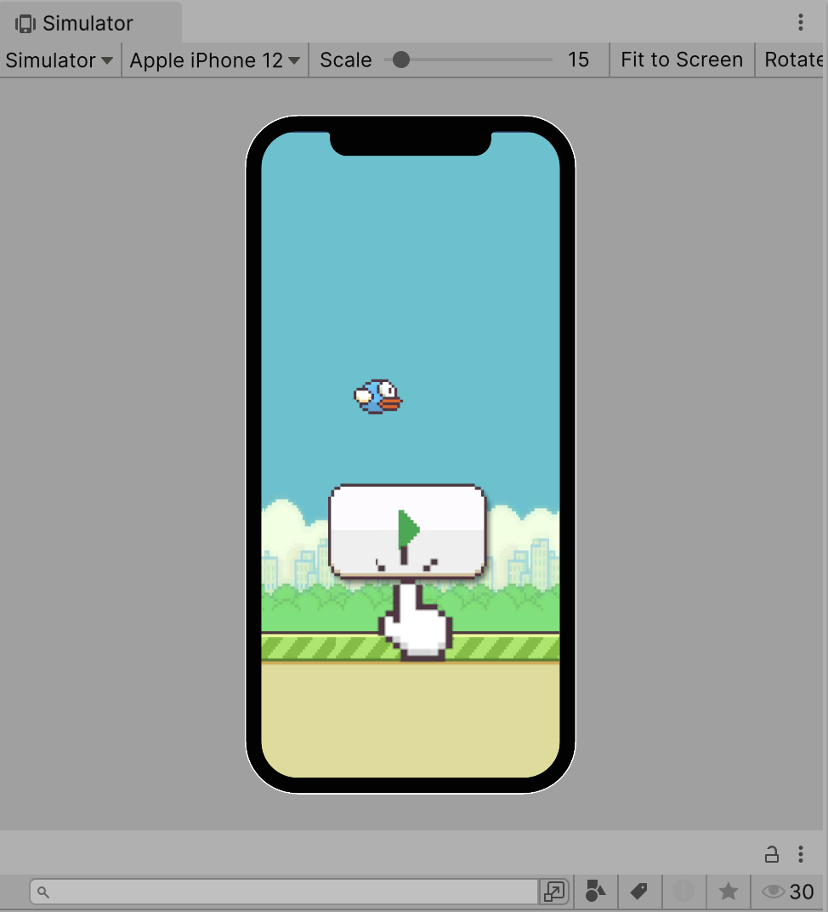
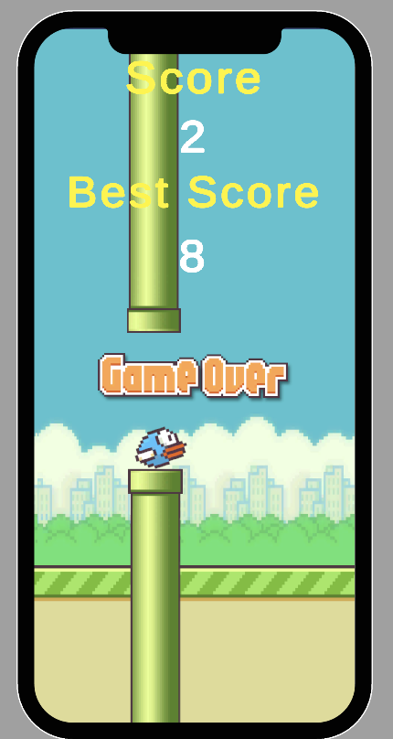

# 🐦 Flappy Bird Unity Demo | Unity游戏开发学习项目
一个基于Unity的Flappy Bird核心功能实现Demo，为学习Unity游戏开发创建
A Unity-based Flappy Bird core functionality demo, created specifically for learning Unity game development

🎯 项目目标 / Project Purpose
这是一个学习向的Demo项目，不追求完美重制，而是专注于：
This is a learning-oriented demo project that doesn't aim for perfect recreation, but focuses on:

* 核心功能实现 / Core functionality implementation
* Unity基础概念演示 / Unity fundamentals demonstration
* C#游戏编程实践 / C# game programming practice

## 主要面向 / Primarily for:

* Unity初学者 / Unity beginners
* 想了解游戏开发流程的新手 / Newcomers wanting to understand game development workflow
* 需要简单项目参考的学生 / Students needing simple project references

## 已完成功能 / Completed Features

* 游戏状态管理 / Game State Management: Ready → Playing → GameOver
* 玩家控制 / Player Control: 点击/空格键控制跳跃 / Click/spacebar jump control
* 碰撞检测 / Collision Detection: 管道和地面碰撞 / Pipe and ground collision
* 分数系统 / Score System: 计分和最高分保存 / Scoring with high score saving
* 无限滚动 / Infinite Scrolling: 地面背景循环 / Ground background loop
* 基础UI / Basic UI: 状态切换界面 / State switching interface

注意: 这是学习项目，目标不是商业级品质！重点是理解和学习。
Note: This is a learning project, The goal of this demo is not perfection! Focus is on understanding and learning.